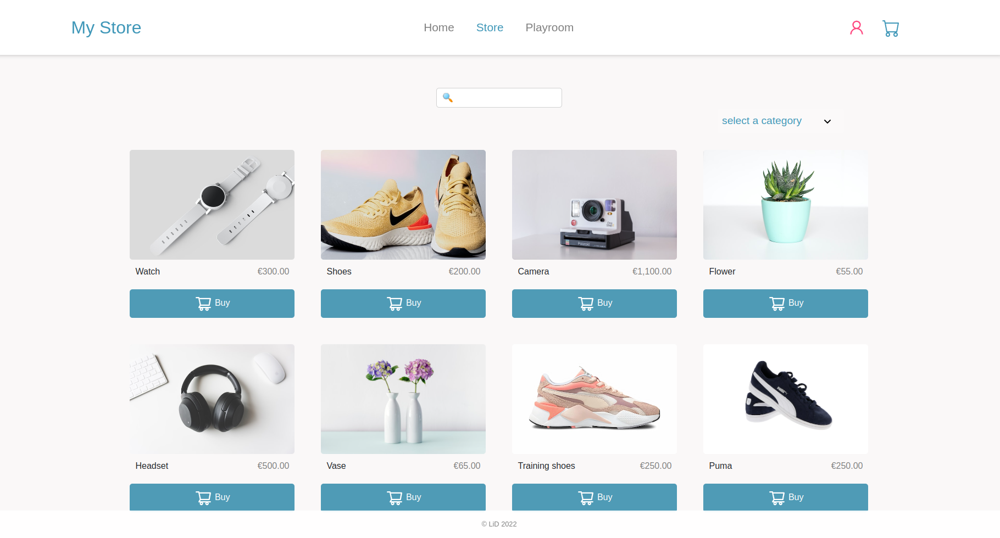
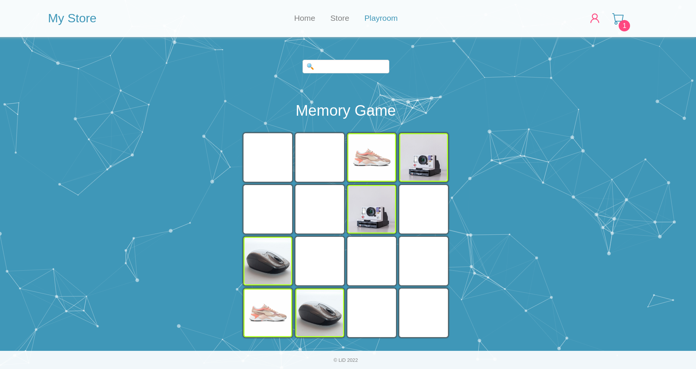

# MyStore App

## Table of contents
* [General info](#general-info)
* [Technologies](#technologies)
* [Setup](#setup)
* [Screenshots](#screenshots)
* [Features](#features)
* [Status](#status)
* [Demo](#demo)
* [Sources](#sources)
* [Contact](#contact)


## General Info
Simple store app created with React.js. This project is a result of my work during the react project week at the one-year full stack web development bootcamp | DCI | 2022.


## Technologies
Project is created with:
* Bootstrap 5
* React-Bootstrap 2
* React.js 18
* CSS3
* Frame-motion 7
* Tsparticles 2


## Setup
To run this project:

* Clone the project
 ```    
https://github.com/dimilidi/store     
  ```

* Go to the project directory
```
$ cd ../shop

```

* Install dependencies
```
$ npm install

```

* Start the server

```
$ npm start

```


## Screenshots




## Features
* users log in/ out
* info page for products
* add, delete, increase, decrease product in cart, clear cart 
* show number of products in badge
* calculation total price
* view product details card
* filter based on products name
* filter based on category
* cart and user saved in local storage
* responsive design 
* product-related memory game


## Status
This is the final version of the app. Feel free to add more functionality and to extend my version. 


## Demo
[See Website](https://store-and-playroom.netlify.app/)


## Sources
* [Particles](https://www.npmjs.com/package/react-tsparticles)
* [Framer-motion](https://www.framer.com/motion/)
* [Framer-motion Library](https://www.npmjs.com/package/framer-motion)
* Products images from (https://unsplash.com/)
* Front-end Design inspired by [Kyle | WDS](https://www.youtube.com/watch?v=lATafp15HWA&t=2971s)
* Many thanks to [mohammadyousefvand](https://github.com/mohammadyousefvand/Shoping-card-react?ref=reactjsexample.com)


## Contact
Created by [@dimilidi](https://github.com/dimilidi) - feel free to contact me!


